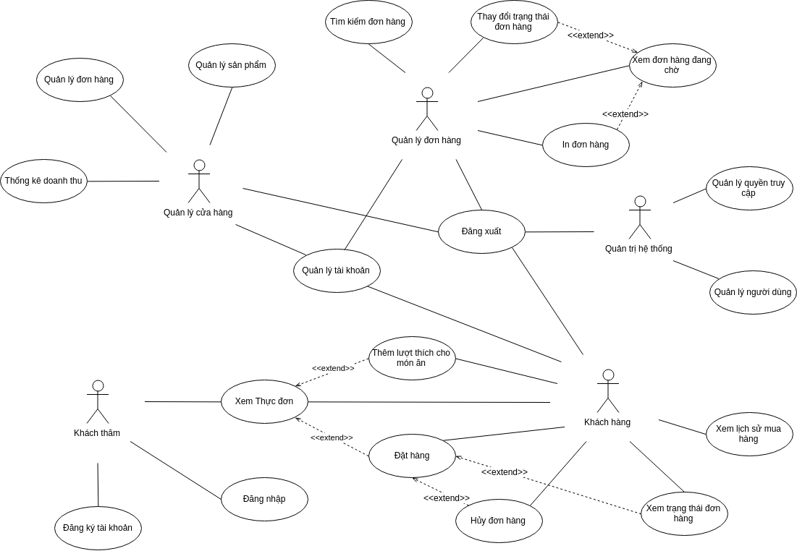

# Đặc tả ca sử dụng

## Biểu đồ usecase tổng quan

Dưới đây là mẫu phác thảo biểu đồ usecase tổng quan của hệ thống:

Yêu cầu các thành viên xem xét và cho ý kiến.

## Phân công công việc

Trong trường hợp không có thay đổi gì nhiều trong việc chỉnh sửa biểu đồ usecase tổng quan đã đưa ra, tôi xin đề xuất cách phân công công việc theo tác nhân như sau:

*   1 người đặc tả các ca sử dụng cho khách thăm và quản trị hệ thống. Đây là hai ca sử dụng đơn giản nhất và có nhiều điểm tương đồng với tài liệu mẫu nhất. Người này xử lý hai usecase chung là "Xem thực đơn" và "Đăng xuất".
*   1 người đặc tả ca sử dụng cho quản lý đơn hàng (ca này hơi ziczac tí, để t nhận)
*   1 người đặc tả ca sử dụng cho khách hàng (cũng khá phức tạp)
*   1 người đặc tả ca sử dụng cho quản lý cửa hàng (chú ý có ba ca chính nhưng mỗi ca lại được phân rã thành nhiều ca con, ví dụ quản lý sản phẩm = thêm + sửa + xóa sản phẩm, vv), phần này cũng có nhiều điểm tương đồng với tài liệu tham khảo. Người này xử lý usecase chung là "Quản lý tài khoản".

## Khuôn dạng bản đặc tả ca sử dụng

Hiện tại t đang hỏi thầy để thống nhất cách viết, nội dung phần này sẽ được cập nhật sau. Trước hết, mọi người hãy cho ý kiến về biểu đồ tổng quan và cách thức phân công công việc.
